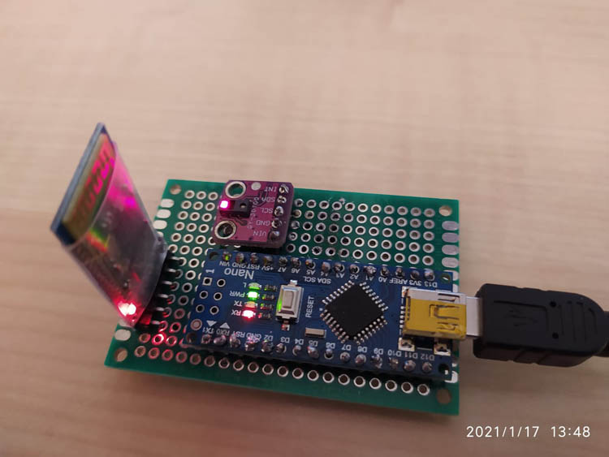
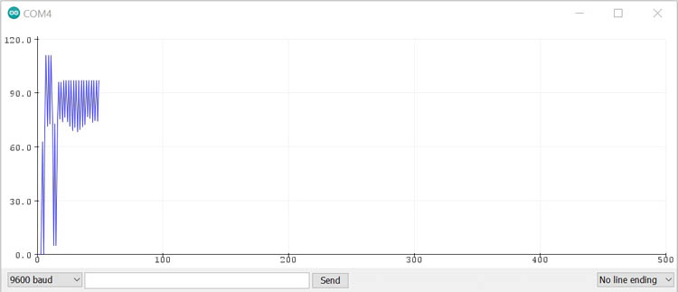
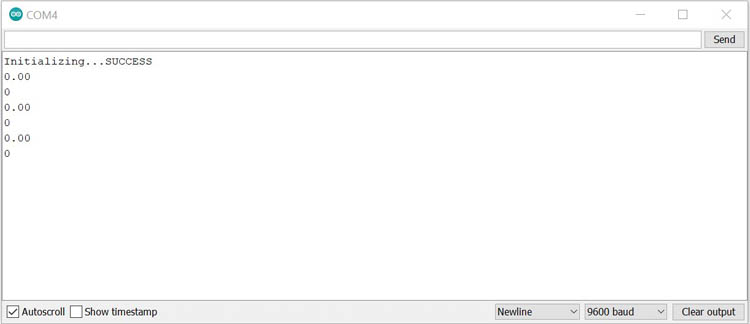

# Pocket Doctor Arduino
> This repository is the hardware part of the Pocket Doctor project. Here you can find all the information about how to connect bluetooth module HC-05 and oxymeter sensor GY-30100 to Arduino Nano board and the code that reads the measurements.

## Table of contents
* [General info](#general-info)
* [Screenshots](#screenshots)
* [Technologies](#technologies)
* [Setup](#setup)
* [Features](#features)
* [Status](#status)
* [Inspiration](#inspiration)
* [Contact](#contact)

## General info
Pocket Doctor is an app intented to simulate the usage of blockchain in a healthcare system. It was developed as a student project with a potential to grow. So far it consists out of 6 repositories :
* Android
* Blockchain
* Backend
* Frontend
* Arduino (this one)
* Recognition

## Screenshots




## Technologies
* Arduino - version 1.8.13

## Setup
Needed components :
* Arduino Nano board - https://www.aliexpress.com/item/32856118319.html?spm=a2g0s.9042311.0.0.40694c4dT11NED
* Bluetooth module HC-05/HC-06 - https://www.aliexpress.com/item/32856118319.html?spm=a2g0s.9042311.0.0.40694c4dT11NED
* Oxymeter GY-30100 - https://www.aliexpress.com/item/4000083361778.html?spm=a2g0s.9042311.0.0.40694c4dT11NED
* Soldering board or breadboard 
* Some wires

Arduino - HC-O5 : </br>
* 3V3 - VCC
* GND - GND
* TXD - RXD
* RXD - TXD
</br>
Arduino - GY-30100 : </br>
* 5V - VIN
* SCL - A5
* SDA - A4
* GND - GND
</br>
Download code and upload it on the board. </br>
Make sure that the RXD, TXD pins on the bluetooth are disconnected while you are uploading, otherwise you will get an error.

## Code Examples
Libraries : </br>
```cpp
#include <Wire.h>
#include "MAX30100_PulseOximeter.h"
``` 
Reading data from sensor : </br>
```cpp
Serial.println(pox.getHeartRate());
Serial.println(pox.getSpO2());
``` 

## Features
Supports reading :
* Beats per minute
* Oxygen levels

## Status
Project is:  _finished_ </br>
All purpose of this repository is to read data from sensor and send it via bluetooth to android application.

## Inspiration
Project is based on : https://how2electronics.com/blood-oxygen-heart-rate-monitor-max30100-arduino/

## Contact
Created by [@JanaJankovic](https://github.com/JanaJankovic) - feel free to contact me on one of the emails :
* jana.jankovic@student.um.si
* jana.j00@outlook.com
* jana.jankovic.feri@gmail.com
